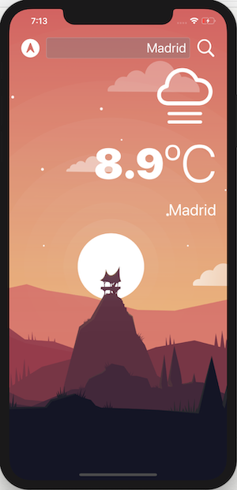

# Weather
Mobile app that uses APIs to fetch and display live weather data.

To run the app you would need to get your personal API key from OpenWeather. Sign up: https://home.openweathermap.org/users/sign_up

In project file *WeatherManager.swift*, replace "my-api-key" with your newly generated key and run the project in Xcode.

 
